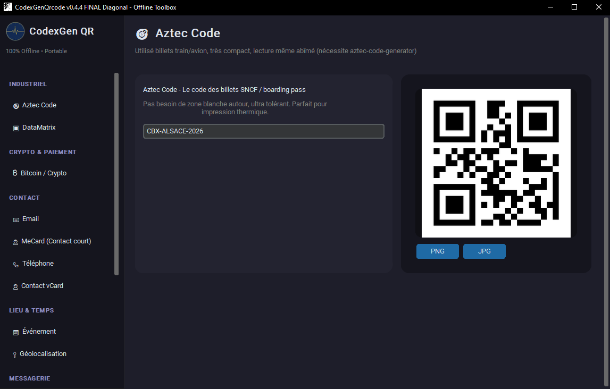

<p align="center">
  
</p>

# CodexGenQrcode v0.4.3

<p align="center">
  
</p>

<p align="center">

### ⬇️ [Télécharger CodexGenQrcode v0.4.3 (Windows)](https://github.com/CircaFrax/CodexGenQrcode/releases/download/v0.4.3/CodexGenQrcode_v0.4.3.zip)
`SHA256: 30e0240d75d000b6be5515da42594df88d0fdcfa186364f96249801d7601c91d`

</p>

# Les plus simples outils devraient rester offline.**

> Pas besoin de cloud pour partager une adresse. Juste un carré qui marche, même sans réseau.

CodexGenQrcode c'est ton utilitaire qui te manquait quand t'es au fond d'un atelier ou dans une zone sans réseau, sans 4G, et que tu dois filer un WiFi, une position GPS ou une carte de visite. C'est l'anti-générateur-en-ligne.

Pendant que les autres chargent 15 trackers, lui il génère. En local. Sans pub.

## Aperçu

*Menu à gauche, prévisualisation live à droite – 100% offline*

## Idée : Le Codex Central et ses 14 Forges

Sur internet tu as tout, mais il faut du réseau. Et tu laisses tes données.

Les 4 familles de forges :

**FORGE ESSENTIELLE** - Le lien brut. Le plus utilisé offline. `https://` ou un simple texte. Tu colles, ça QR.

**FORGE CONTACT** - La carte de visite qui ne meurt jamais. On encode tout en `vCard`, `MeCard`, `mailto:`, `tel:`, `SMSTO:`, `wa.me`. Le téléphone propose direct "Ajouter au contact" ou "Envoyer SMS".

**FORGE TERRAIN** - Pour le vrai monde. `WIFI:T:WPA;S:...` qui connecte auto, `geo:48.9,7.8` qui ouvre Maps, `VEVENT` qui ajoute une date au calendrier. Idéal pour un atelier, un point de collecte, une réu.

**FORGE INDUSTRIELLE** - Le petit format qui pique. `DataMatrix` 2x plus compact que QR pour marquer un PCB ou un flacon, `Aztec` des billets SNCF qui n'a même pas besoin de marge blanche, et `bitcoin:` pour payer sans faute de frappe.

Philosophie : 1 Codex = 1 télécommande, 14 cerveaux. Phase 1 = tu tapes, Phase 2 = tu prévisualises en live, Phase 3 = tu exportes en PNG/JPG/SVG avec tes couleurs et ton logo.

### 📖 Utilisation

1. Lancer `_Code/CodexGenQrcode.exe
2. Dans la liste à gauche, cliquer :
   - URL = site, YouTube, Drive
   - WiFi = SSID + WPA
   - Géo = lat/lon de l'atelier
   - Event = titre / lieu / début / fin
   - SMS / WhatsApp / Tel / Email = message pré-rempli
   - vCard / MeCard = carte de visite
   - DataMatrix / Aztec / Bitcoin = indus
3. Personnaliser à droite : taille, correction, couleurs, logo
4. Exporter PNG / SVG. Vérifier en scannant avec ton téléphone.

### 📁 Structure

```
CodexGenQrcode/
├───CodexGenQrcode.exe
├───LICENCE.md
├───LICENSE.md
└───THIRD_PARTY_LICENSES.md
```

### 🔒 Confidentialité
- **Zéro réseau** : tout se passe sur votre PC
- `exiftool.exe` by Phil Harvey (Artistic License) - embarqué localement

### 📄 Licence
CircaFrax Proprietary Freeware

---
**Fait partie de la suite Codex** — des logiciels qui s'utilisent sans installation, comme en 1998, mais en mieux.
